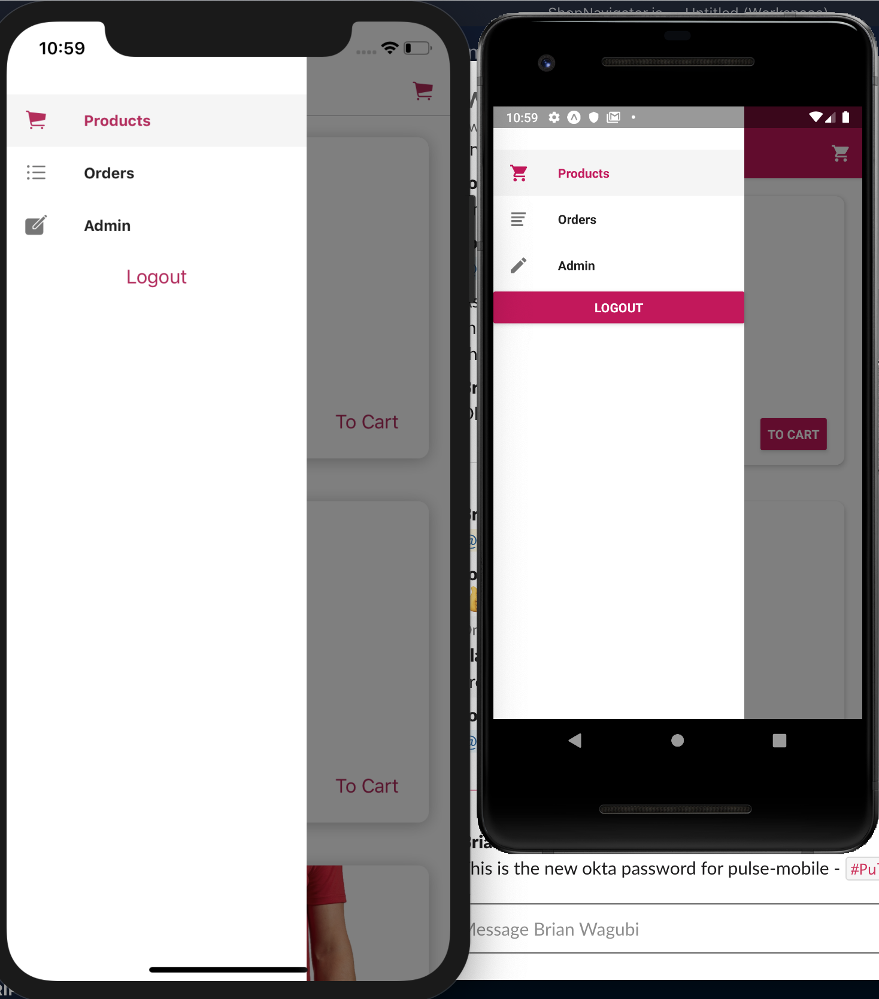

# ShopToDay

ShopToDay is a mobile application built with React-native to help small bussiness users buy and sell goods online,

## Getting Started

These instructions will get you a copy of the project up and running on your local machine for development and testing purposes.

### Prerequisites

```
- Android Emulator
- JDK
- IOS Emulator
- Xcode 10+
```

### Installing

```
- Clone the repo into your local env using terminal
- install dependencies/packages by running yarn or npm install
```

## Built With

- Expo

```
Technologies
- React-native
- React
- Redux
- React-navigation
- React Hooks
- Google Firebase
```

## Images

#### Login Screen


#### Products Display Screen


#### Product Detail Screen


#### Cart Screen


#### Navigation Drawer



#### Admin Screen


#### Edit Screen


#### Create Screen


## Authors

- **Mugisha Joshua**
